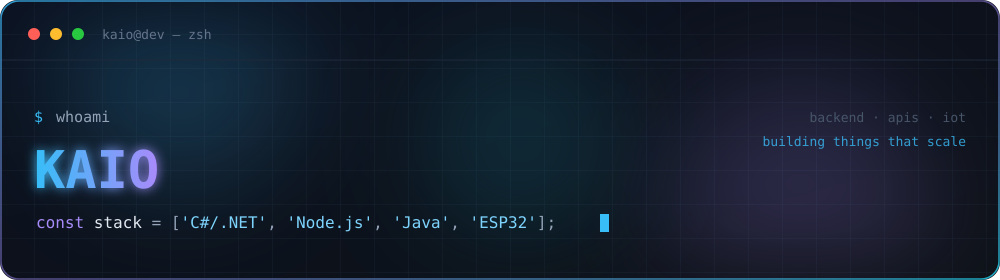

<div align="center">
  
</div>

<div align="center">

<a href="https://www.linkedin.com/in/dev-kaio"></a>


</div>

<br/>

```console
$ cat kaio.json
{
  "role":     "Fullstack Developer",
  "building": ["APIs REST", "interfaces em React", "coisas que falam com o mundo físico"],
  "back":     ["C# / .NET", "Node.js", "Java", "PostgreSQL"],
  "front":    ["React", "JavaScript", "HTML", "CSS"],
  "learning": "arquitetura, EF Core, boas práticas",
  "motto":    "código que escala > código que só funciona"
}
```

<br/>

<div align="center">

**front**<br/>


**back**<br/>


**dados & ferramentas**<br/>


</div>

<br/>

## Projetos

<table>
<tr>
<td width="50%" valign="top">

### Emissão de Notas Fiscais
Sistema de notas fiscais em microsserviços: emissão com múltiplos itens e baixa automática de estoque.

`C#` `.NET` `EF Core` `Angular`

**[código](https://github.com/dev-kaio/Korp_Teste_KaioManfroDaSilva)**

</td>
<td width="50%" valign="top">

### Afiação de Brocas · Projeto Integrador
PWA e API que controlam a máquina de afiação pelo ESP32 e registram relatórios de uso das brocas.

`Node.js` `Firebase` `C++` `PWA`

**[código](https://github.com/dev-kaio/Projeto-Integrador)**

</td>
</tr>
<tr>
<td width="50%" valign="top">

### API Spotify
API REST de músicas com upload de áudio e capa, streaming, download e busca por nome.

`C#` `.NET` `EF Core` `SQL Server`

**[código](https://github.com/dev-kaio/API-Spotify)**

</td>
<td width="50%" valign="top">

### Controle de Ferramentaria
PWA para retirada e devolução de ferramentas — controle de quem pegou, o quê e quando.

`JavaScript` `PWA` `Firebase`

**[código](https://github.com/dev-kaio/Controle-de-Ferramentas)** · **[demo ao vivo](https://dev-kaio.github.io/Controle-de-Ferramentas/)**

</td>
</tr>
<tr>
<td width="50%" valign="top">

### Calendário de Cursos
App web para consultar, cadastrar e gerenciar cursos em andamento e futuros.

`JavaScript` `Web`

**[código](https://github.com/dev-kaio/CalendarioSENAI)**

</td>
<td width="50%" valign="top">

### ESP32 · LED Morse
IoT: transmite mensagens em código Morse piscando um LED no ESP32.

`C++` `IoT` `Embarcado`

**[código](https://github.com/dev-kaio/ESP32-LedMorse)**

</td>
</tr>
<tr>
<td width="50%" valign="top">

### Próximos
Sempre tem algo cozinhando por aqui. Dá uma olhada nos repos.

`em breve`

**[ver todos](https://github.com/dev-kaio?tab=repositories)**

</td>
</tr>
</table>

<br/>

<div align="center">

## Contribuições

<picture>
  <source media="(prefers-color-scheme: dark)" srcset="https://raw.githubusercontent.com/dev-kaio/dev-kaio/output/snake-dark.svg?v=2"/>
  <source media="(prefers-color-scheme: light)" srcset="https://raw.githubusercontent.com/dev-kaio/dev-kaio/output/snake.svg?v=2"/>
  
</picture>

</div>

<br/>

<div align="center">

## Bora trocar ideia?

Aberto a colaborações, projetos e conversa sobre front, back e IoT.

<a href="https://www.linkedin.com/in/dev-kaio"></a>
<a href="https://github.com/dev-kaio"></a>

<br/><br/>


</div>
